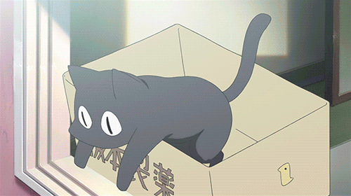

<table>
<tr>
<td width="40%" align="center">

</td>
<td width="60%" align="left" valign="top">


> *<span style="color:#6D28D9; font-size:20px">"猫ですからお菓子ちょうだい！"</span>*
> <sub>— karena kucing hitam juga butuh ngemil sambil ngoding</sub>

Mahasiswa semester 6 Teknik Informatika di **UBSI**, kucing nyasar jadi Full-Stack / Frontend / Backend Developer. Paling produktif pas kota udah sepi dan lampu neon jadi satu-satunya penerang.

</td>
</tr>
</table>

---

## 🌙 `whoami --at-2am`

Mirip kucing hitam yang baru keluar sarang begitu matahari tenggelam — bisa jalan sendirian (*lone wolf mode*) atau gabung tim tergantung mood dan deadline. Prinsip hidup sederhana:

```bash
if (bug.isMisterius() && jam > 24) {
  mending_turu(); // besok juga ilang sendiri kok (kadang)
}
```

---

## ⚡ `npm run stack`

**Languages**


**Frontend**


**Backend & Database**


**Deployment & Ops**


---

## 🐈‍⬛ `cat /etc/profile.d/kuroneko.conf`

* **Kebiasaan:** begadang, mangkal tengah malam buat ngoding / maraton anime / nge-game — jam produktif justru pas orang lain udah tidur.
* **Insting kucing hitam:** kalau nemu bug aneh jam 2 pagi, opsi terbaik cuma dua — `debug()` atau `mending_turu()`. Biasanya menang yang kedua.
* **Territory:** rebahan di atas keyboard hangat, laptop nyala sampai pagi.

---

## 🗣️ `cat /etc/locale.conf`


<sub>N3 setara — cukup buat nonton anime tanpa juling merhatiin subtitle 🎌</sub>

---

## 🔗 `ping /social-links`

<div align="center">

[](https://www.instagram.com/_koyu_02/)
[](yurita__)
[](mailto:ppyurico@gmail.com)

</div>

---

<div align="center">


<br><br>

> *<span style="color:#6D28D9;">// "I'm weird? That's the highest compliment you could give me, nya~."</span>*

<br>


</div>